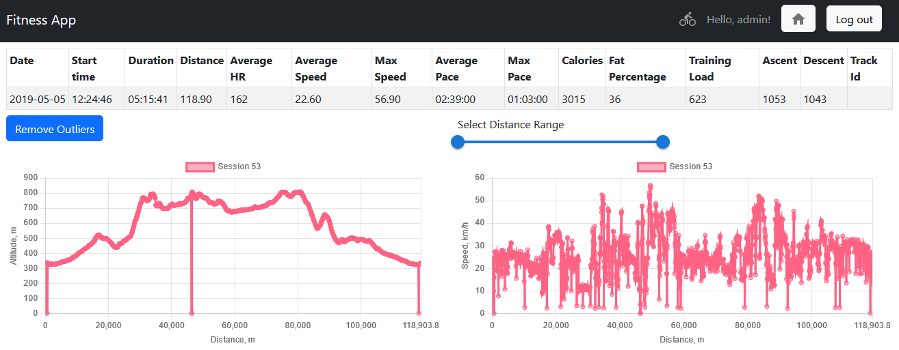

# FitnessApp
The app is the final project of [CS50W](https://cs50.harvard.edu/web/2020) course. The course certificate is [here](https://cs50.harvard.edu/certificates/12708d7b-dde4-40ac-ab22-5e6e4bcd5f0f).


## Contents
- [Overview](#Overview)
- [Features](#Features)
- [API](#API)
- [How to run](#HowToRun)

## <a id="Overview"></a> Overview
The app is a sport activity analyser. It allows to store, visualize and analyse the training data recorded by the fitness watch.
 [Demo video](https://youtu.be/3tud0QvcTZs)

The technologies used are Django for the back-end and React for the front-end.
## <a id="Features"></a>Features
* Import and store training session data  in **csv** format.
  * Training data has to be in the format like the samples in the **./in** folder.
  * Additionally to the data  the **track id** can be optionally specified. **Track id** allows to identify the training sessions on the same track for their further comparison.
* View the list of the logged in user training sessions statistics
  * Sorted by the date of activity in descending order
  * The type of activity (sport) can be selected
  * The activity type icon in the navigation panel shows the selected sport
  * Training sessions can be deleted and opened from this list
  * Columns change depending on which activity is selected
  * Standard user registration and login/logout
* Opening the training session results in the visualization of its data
    * Statistics
    * Plots
      * The outliers can be removed (one can toggle between the view with or without outliers)
      * For performance reasons the amount of plotted fulcrums is being dynamically reduced
      * The x-axis range can be changed
      * One training session can be selected from the list for comparison (and deselected)
    * List of the training sessions with the same track id and the same sport

## <a id="API"></a>API
* `api/logout` - logout authenticated user
* `api/login` - login existing user
* `api/register` - register new user
* `api/current_user` - get authenticated user info
* `api/add_training_data` - add training session to the DB
* `api/delete_training_data` - delete training session from the DB
* `api/get_training_metadata` - get training sessions metadata for the authenticated user, filtered by sport, track id or training id
* `api/get_training_metadatum` - get single training session metadata for the authenticated user
* `api/get_training_datum` - get data for a single training session
* `api/remove_outliers` - get data with outliers removed for a single training session

## <a id="HowToRun"></a>How to run
### Install dependencies
#### Backend (python3.8)

Using pip

>pip install -r requirements.txt

...or [micromamba](https://mamba.readthedocs.io/en/latest/installation/micromamba-installation.html)


>micromamba create -n fitness-app-env -f mamba-env.yml

#### Frontend
```
cd frontend
npm install
```

Build React app:
```
npm run build
cd ..
```


### Run

Run Django server:

>python manage.py runserver

or with micromamba without environment activation:
>micromamba run -n fitness-app python manage.py runserver

